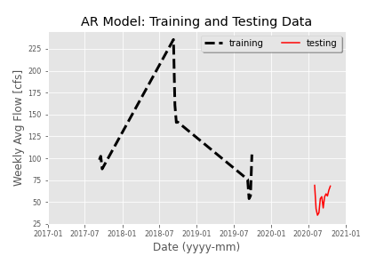

# **Gillian Noonan**  &#x1F604;
## *Homework 8*
### 10/19/20
___

### Grade

---
### Week 8 Questions

I put most of the new development hours this week and last week into adding some additional code to auto-generate the one-week, two-week, and seasonal forecasts.  I also added the suggested edits by my partner, Jacob.  

1) A brief summary of the AR model you built and why. Use whatever graphs you find helpful.
- The AR model I built in Week 6 used trial and error of many different testing periods trying to get the best r2 value.  The best r2 value I came up with finally was by picking out September data for just recent years (2017-2019), and then testing on the last 11 weeks of data (record 1648 onward).  The graphs are redundant to Week 6 but they show the testing and training periods (Figure 1), the fit of the data for the actual versus the model-simulated (Figure 2), and the scatter plot of AR model fit (Figure 3).

Figure 1

Figure 2

Figure 3

2) An explanation of how you generated your forecasts and why (i.e. did you use your AR model or not?)
-    I used my *new!* code to generate my one and two-week forecasts.   It might still seem simple to some but I feel like I'm really coming along with the coding part and was proud that i was able to figure something out that would be automated and fit with what I was using in the past for forecasting manually.   For the one-week forecast: I take the mean of the previous 7 days of data and then add or subtract a factor based on the trend of the past week - value is forecast based on positive or negative trend and percent of change. For the two-week forecast, I repeat this process but for a two-week period.

Interestingly, my AR modelforecast values, run very close to my code forecast values, "Jill's code", which runs very close to historical mins for the time periods as seen in the table below:

| Forecast Time Period   | AR Model   | Jill's Code  | Historical Min  |
|--:|---|---|---|
| One-week (10-18 to 10-24)  | 80.2  | 70.8  |  73.9 |
| Two-week (10-25 to 10/31)  |  88.5 |  79.2 | 83  |

Seeing as I have been using historical minimums mostly all along for my seasonal forecasting, I opted to continue with this forecast method since both of my other models are forecasting very close to historical minimums.

3) A brief summary of what you got out of the peer evaluation. How did you make your script better?
-

4) Describe the part of your script that you are most proud of and why.  
-

---

&#x1F600;
**Thanks!**
