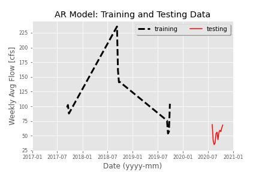
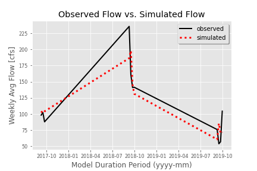
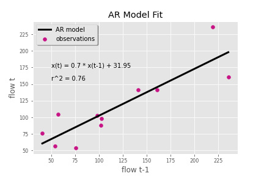
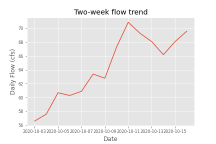
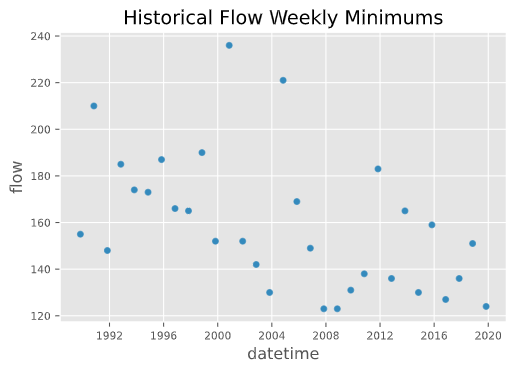

# **Gillian Noonan**  &#x1F604;
## *Homework 8*
### 10/19/20
___

#### Grade 
 - 6/6  Great  job!
 - Readability: 3
 - Style: 3 
 - Code: 2

 - Really glad to hear that you had a good week, your code looks great!
 - Nice work on your code I like your use of functions and its really neat and easy to followin 
 - I made some suggestions for where you can condense. 

---
### Week 8 Questions

I put most of my development hours this week and last week into adding and/or modifying code to auto-generate the one-week, two-week, and seasonal forecasts.  I also added the suggested edits by my reviewer, Jacob.  As well, I focused on condensing and making my code a whole lot more succinct and efficient and "elegant" as they say.  And made it so that you could just run it and all of the text strings and print statements would tell the consecutive story clearly.  A big feat from where I started, really.  *Side note: I had not even really considered or ever used the "run all below" or "above" buttons until last week's lightbulb moment with the code trades!!*

*1) A brief summary of the AR model you built and why. Use whatever graphs you find helpful.*
- The AR model I built in Week 6 used trial and error of many different testing periods trying to get the best r2 value.  The best r2 value I came up with finally was by picking out September data for just recent years (2017-2019), and then testing on the last 11 weeks of data (record 1648 onward).  The graphs are redundant to Week 6 but they show the testing and training periods (Figure 1), the fit of the data for the actual versus the model-simulated (Figure 2), and the scatter plot of AR model fit (Figure 3).

*Figure 1: AR Model test and train data periods*  

*Figure 2: Observed vs. Simulated Flow for AR Model*  

*Figure 3: AR Model fit*  

*2) An explanation of how you generated your forecasts and why (i.e. did you use your AR model or not?)*
-    I used my *new!* (as of Week 7) "Jill's code" to generate my one and two-week forecasts.   It might still seem simple to some but I feel like I'm really coming along with the coding part and was proud that i was able to figure something out that would be automated and fit with what I was using in the past for forecasting semi-manually (entering code-calculated numbers and lots of repeated code lines).  For the one-week forecast: I take the mean of the previous 7 days of data and then add or subtract a factor that is calculated based on the trend of the past week.  This value is calculated based on positive or negative flow trend over time (Figure 4) and percent change of flow rate. For the two-week forecast, I repeat this process but consider a two-week period for the trend analysis.

- Interestingly, my AR model forecast values run very close to my freeform code forecast values, "Jill's code", which runs very close to historical mins for the time periods as seen in Table 1 below.  Figure 4 plots the two-week flow trend for last 14 days of flow data.  

*Table 1:  Forecast method value comparison*

| Forecast Time Period   | AR Model   | Jill's Code  | Historical Min  |
|--:|---|---|---|
| One-week (10-18 to 10-24)  | 80.2  | 70.8  |  73.9 |
| Two-week (10-25 to 10/31)  |  88.5 |  79.2 | 83  |

Figure 4  

- Seeing as I have been using historical minimums mostly all along for my seasonal forecasting (since we are in such a low flow year), I opted to continue with this forecast method since both of my other models are forecasting very close to historical minimums.  HOWEVER, I did change the way I did it to complete the weekly requirement of time series work.  I previously was simply pulling the data out of the dataframe by month and day for the weekly periods, and then calculating the min flow value.  For this week's seasonal forecast - I forecast all upcoming dates (starting at Week 11 since previous weeks have already passed or were forecast via the one- and two-week forecasts above) using a new dataframe that I created where I aggregated the data by weekly flow min.   The numbers for historical flow min change just a bit from my previous method of exact day pull out since the weekly binning goes Monday to Sunday, whereas our forecast weeks go Sunday to Saturday.  Still very close and good enough for government work!  I also played around with plotting and plotted the historical flow min for each weekly period over the years in a scatter plot.   This provided an interesting visual perspective for where our overall weekly minimum flow value fit in over the last 30 years.  An example of that plot type is shown in Figure 5.  

*Figure 5. Historical minimum flows for Week 11*  

*3) A brief summary of what you got out of the peer evaluation. How did you make your script better?*
- My peer evaluation identified a couple of things that were helpful for my learning.  First, it was nice to hear compliments from a peer on things I was doing well.   Good reassurance.  Second, it was useful to get another's perspective on how I could be doing things better.  For example - I was using an if/elif statement and my reviewer pointed out that it should be an if/else statment else my code would fail if the percent change was 0 (highly unlikely, but not impossible).  So I changed that.   When we had out "face-to-face" review in class time, he also helped me work towards a solution to pull out the values I was entering manually for last week's average flow.   This was crucial to having the code run autonomously for this week's assignment.

*4) Describe the part of your script that you are most proud of and why.*  
- Honestly I feel like this has been my biggest improvement week yet.   I could feel the difference in the way I was writing the code where it felt more like "writing" with flowing ease versus trying to fit pieces of a puzzle together.  I had a lot of moments of new understanding that seemed to click this week and added some elements that were a step up for my code, including;  an if/else conditional statement for my calculated forecast output, an extra function(!), some indexing and time series elements, and a lot of little touches that improved the overall flow of the output (like adding, organizing and refining 'print' statements.)

*5) Other notes:*
- One thing i was trying to do but could not figure out in time was how to save my images to pngs that are happening in my function (the historical minimums).   If I add, for example, plt.savefig('Wk-min.png'), to my function, it will just overwrite the plot each time I run the function.   I then tried putting this outside of the function and it just gives me a blank frame.  
---

&#x1F600;
**Thanks!**
