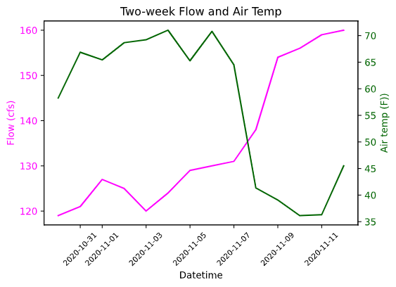
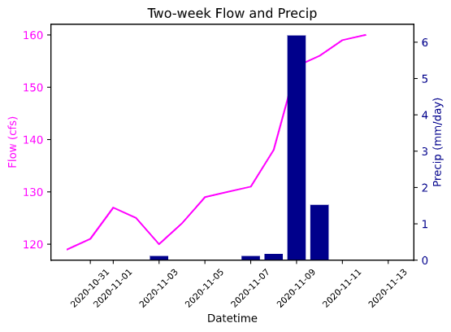

# **Gillian Noonan**  
## *Homework 12*
### 11/16/20
___

### Grade

---
### Week 12 Questions
---
*1)A brief summary of the how you chose to generate your forecast this week.*
- I used the same tried and true method of looking at the two-week trend and forecasting upward or downward based on a percent change factor from positive or negative weekly/bi-weekly trend in flow.

*2)A description of the dataset you added.*
- I grabbed data for historical air temp (given in degrees K) and historical precipitation (in mm/day) for the time period of streamflow data beginning up to most recent available. I selected the location span using the recommended bounding box from the assignment instructions. Both datasets were downloaded as netcdf files and then converted to pandas dataframes for plotting alongside streamflow.

*3)What is the dataset? Why did you choose it?*
- I chose both air-temp and precipitation datasets, thinking that they would be two factors to affect streamflow and would also be easily understood.  I was interested in other data but found it was unavailable (for example, the Palmer drought rating seemed interesting for historical analyses but was not available).  In the end, I went with what seemed easy to work with since the coding process itself is a challenge enough for me typically.

*4)What is the spatial and temporal resolution and extent of the data ?*
- The spatial resolution is a single lat/long point for each dataset, plotted over time to create a timeseries.  Lat/long = 247.25, 35.75.   Temporal resolution matches with the streamflow dataset - 1989-01-01 to 2020-11-12.

*5)Where did you get the data from?*
- I downloaded two datasets from Physical Science Laboratory Site:
    - historical air temp (1989-present) 'NCEP Reanalysis Daily Averages - Temp'
    - historical precip (1989-present) 'CPC Global Precipitation'

*6)What was your approach to extracting and aggregating it into something useful to you?*
- I converted both datasets to pandas dataframes to work with.  I converted the air-temp to Fahrenheit and added column to the dataframe.  The original intention was to go back to my AR model and work on and improve it using the historical air temp and precipitation, but despite much trialing and googling, I could not get the "time" column to set as index in the air_df.  Nor could I get the time column to expand to year, month, day, or a bunch of other trials to set datetimeindex.  When I looked at df.columns, it is not listed as a column, but also did not act as a typical index in calls.  Very confusing and probably highlighting some of my continued "newbie" challenges.  In any case, due to time constraints (worked on it for many many hours though!), I just used this newly acquired data to practice plotting and playing with the netcdf data format and pandas dataframe actions, and observing trend influence over the last two weeks for my two-week trend forecast base method.  So in the end, I ended up using daily data pulled out for last two weeks.

*7)A plot of the dataset you added. This can be a timeseries, map, histogram or any other plot that you think is a good summary of what you added.*
- Here are the plots I created, which look at last two-week's flow data, alongside historical air temperature (converted to degrees F) and precipitation (given in mm/day).  The flow and air-temperature plot is interesting as it appears to show a direct correclation of high air temp to low flow and vice versa.  The precipitation also shows some correlation, though i think this would be much less direct considering the fact that it is only 6mm/day maximum and the effects of precipitation from across the watershed would all have an effect, not just this one lat/long selection.  I would say the likely story is that they all correlate to each other - the air temp drops when the precipitation increases (storm came through), and the flow increases due to more water added and less evaporation (decreased temperature and increased humidity)

Plot 1:  
  

Plot 2:  

---

&#x1F600;
**Thanks!**  
