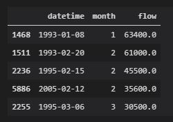
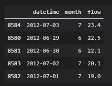

# **Gillian Noonan** &#x1F604; &#x1F44D;
## *Homework 5*
### 9/28/20

---------

### Week 5 Questions
---

**1. Provide a summary of the data frames properties.**  
        -  Dataframe "data" has 8 columns of data, 11591 rows, and multiple data types
  - **What are the column names?**
    * 'agency_cd', 'site_no', 'datetime', 'flow', 'code', 'year', 'month', 'day'
  - **What is its index?**
    * RangeIndex is 0 to 11590 (start=0, stop=11591, step=1)
  - **What data types do each of the columns have?**
    * Using the same order listed above - object, int64, object, float64, object, int32, int32, int32.  

_Figure 1: dataframe info_  

**2. Provide a summary of the flow column including the min, mean, max, standard deviation and quartiles.**  

_Figure 2: flow statistics_All_  

**3. Provide the same information but on a monthly basis. (Note: you should be able to do this with one or two lines of code)**  

_Figure 4 - flow statistics_monthly_   

**4. Provide a table with the 5 highest and 5 lowest flow values for  the period of record. Include the date, month and flow values in your summary**  

_Figure 4 - Five highest flow values_  

_Figure 5 - Five lowest flow values_  

**5.  Find the highest and lowest flow  values for every month of the year (i.e. you will find 12 maxes and 12 mins) and report back what year these occurred in.**  

_Figure 6 - Flow stats by Month_  

_Figure 7 - Max Flow by Month_  

_Figure 8 - Min Flow by Month_  

  |Month|Year-Min|Min Flow|Year Max|Max Flow|
  |-----|-----|-----|-----|-----|
  |Jan|2003|158|1993|63400|
  |Feb|1991|136|1993|61000|
  |Mar|1989|97|1995|30500|
  |Apr|2018|64.9|1991|4690|
  |May|2004|46|1992|546|
  |June|2012|22.1|1992|481|
  |July|2012|19|2006|1040|
  |Aug|2019|29.6|1992|5360|
  |Sep|2020|36.6|2004|5590|
  |Oct|2012|69.9|2010|1910|
  |Nov|2016|117|2004|4600|
  |Dec|2012|155|2004|28700|

**6. Provide a list of historical dates with flows that are within 10% of your week 1 forecast value. If there are none than increase the %10 window until you have at least one other  value and report the date and the new window you used**

---

&#x1F600;
**Thanks!**  
