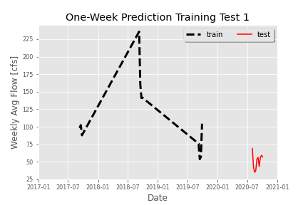
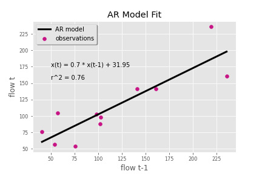
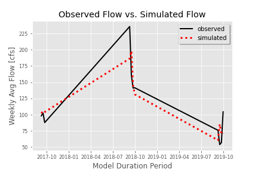
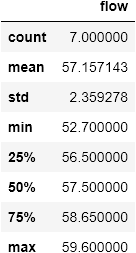
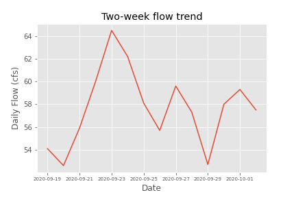

# **Gillian Noonan**  &#x1F914; &#x1F643;
## *Homework 6*
### 10/5/20
___

---
### Week 6 Questions
---
**Provide a summary of the AR model that you ended up building, including:**
-  **(1) what you are using as your prediction variables**

  -  For the one-week prediction I used the single value prediction example using last week's average flow value (56).   It gives me a prediction value of 71.  This is surprisingly near to what i predicted last week for the two-week forecast, which was 69.9.  

- **(2) the final equation for your model**

  - x(t) = m * x(t-1) + b = 0.7 * x(t-1) + 31.95

- **(3) what you used as your testing and training periods. In your discussion please include graphical outputs that support why you made the decisions you did with your model.**

  - I tried a number of different prediction variables for the training period using the base code in my .py file.   I tried looking at data over all time up to test period (most recent 10 weeks), all data since 2015 up to test period, and all data 2017 up to test period.   The model r2 values were quite low for these trials (ranging from around 0.1 to 0.3) so i decided to isolate just data in the month of September to try to improve the model.   I then added in a month == variable and I looked at both all September data since 2015 and came up with an r2 of 0.62, which was improved.  Shifting that window up to 2017 - 2019 for the September data training period gave me an r2 of 0.76 which may be as good as it will get! I also tried adding in the month of August using the or (|) statement, but the fit was decreases so I stuck with just September for training data.  The figure below shows my final testing and training periods plotted.  These gave me the best fit for linear regression from all of my trials.  

**Provide an analysis of your final model performance. This should include at least one graph that shows the historical vs predicted streamflow and some discussion of qualitatively how you think your model is good or bad.**  
  - ....  

**Finally, provide discussion on what you actually used for your forecast. Did you use your AR model, why or why not? If not how did you generate your forecast this week?**  

    - Discussion for the Week 6 forecast:
      - One-week forecast - I did not use my AR model becuase i think it will be too high based on the current historical lows we are experiencing.   

        I used my base code from last week.  I did make some edits though - for example i discovered and imported dataframe_image to export tables to png (no more snip and save!).  I did have to fix a typo in the starter code to make it work ((date-year-month-day expansion) where it made ".day" equal to ".dayofweek" in error), but it was a good code hunt to figure out why it wasn't working!

        I looked at the last 7 days and the min, max and mean value. I then looked at the data trend plot over the last two weeks and it is trending pretty steady so I went right around the mean for prior 7 days for the 1wk forecast.

**last 7 days stats**  
  

**data trend plot**  

      - Two-week forecast -  

      - Seasonal forecast -

---

&#x1F600;
**Thanks!**  
